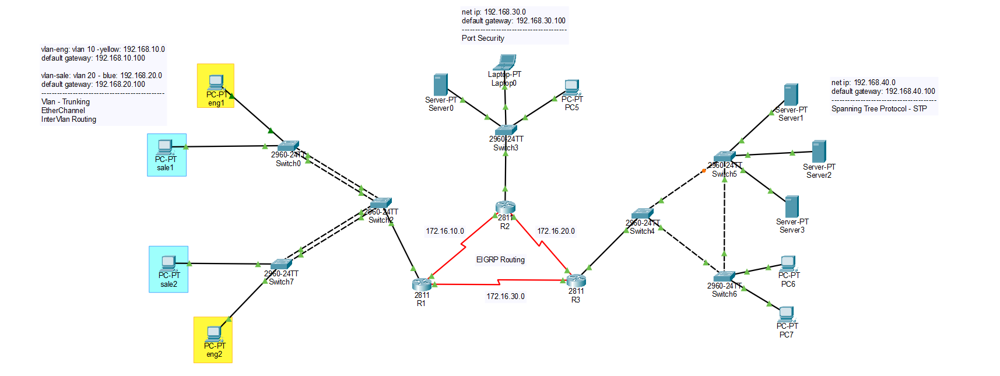

# Enterprise Switching & EIGRP Lab

> **Author:** Amirhossein Tavakoli  
> **Tool:** Cisco Packet Tracer  
> **Level:** Advanced

---

## 📋 Overview

This lab simulates a small enterprise network combining Layer 2 and Layer 3 technologies. It demonstrates VLAN segmentation, Inter-VLAN Routing, EtherChannel, Spanning Tree Protocol (STP), Port Security, and EIGRP dynamic routing between multiple routers.

---

## 🖧 Topology



---

## 🎯 Objectives

- Configure multiple VLANs
- Configure Access and Trunk Ports
- Configure EtherChannel
- Configure Spanning Tree Protocol (STP)
- Configure Port Security
- Configure Inter-VLAN Routing (Router-on-a-Stick)
- Configure EIGRP Dynamic Routing
- Verify end-to-end connectivity

---

## 🔧 Devices Used

| Device | Model | Role |
|--------|-------|------|
| R1 | Cisco 2811 | Router |
| R2 | Cisco 2811 | Router |
| R3 | Cisco 2811 | Router |
| Switch0-7 | Cisco 2960 | Layer 2 Switches |
| PCs | PC-PT | Client Devices |
| Servers | Server-PT | Server Network |
| Laptop | Laptop-PT | Client Device |

---

## ⚙️ Key Configurations

### VLAN Configuration

```bash
Switch(config)# vlan 10
Switch(config-vlan)# name Engineering

Switch(config)# vlan 20
Switch(config-vlan)# name Sales
```

### Trunk Configuration

```bash
Switch(config)# interface fa0/1
Switch(config-if)# switchport mode trunk
```

### EtherChannel

```bash
Switch(config)# interface range fa0/1-2
Switch(config-if-range)# channel-group 1 mode active
```

### Inter-VLAN Routing

```bash
Router(config)# interface fa0/0.10
Router(config-subif)# encapsulation dot1Q 10
Router(config-subif)# ip address 192.168.10.100 255.255.255.0

Router(config)# interface fa0/0.20
Router(config-subif)# encapsulation dot1Q 20
Router(config-subif)# ip address 192.168.20.100 255.255.255.0
```

### EIGRP Configuration

```bash
Router(config)# router eigrp 100
Router(config-router)# no auto-summary
Router(config-router)# network 172.16.10.0
Router(config-router)# network 172.16.20.0
Router(config-router)# network 172.16.30.0
```

---

## ✅ Verification Commands

```bash
Switch# show vlan brief
Switch# show interfaces trunk
Switch# show etherchannel summary
Switch# show spanning-tree
Switch# show port-security

Router# show ip eigrp neighbors
Router# show ip route
Router# show ip protocols
Router# ping <destination-ip>
```

---

## 🌐 Network Addressing

| Network | Purpose |
|---------|---------|
| 192.168.10.0/24 | Engineering VLAN |
| 192.168.20.0/24 | Sales VLAN |
| 192.168.30.0/24 | Client Network |
| 192.168.40.0/24 | Server Network |
| 172.16.10.0/24 | Router Link |
| 172.16.20.0/24 | Router Link |
| 172.16.30.0/24 | Router Link |

---

## 📁 Files

| File | Description |
|------|-------------|
| `enterprise-network.pkt` | Cisco Packet Tracer project |
| `topology.png` | Network topology |

---

## 📚 Concepts Covered

- VLAN
- Access & Trunk Ports
- Router-on-a-Stick
- Inter-VLAN Routing
- EtherChannel
- Spanning Tree Protocol (STP)
- Port Security
- EIGRP Dynamic Routing
- Enterprise Network Design
- Layer 2 & Layer 3 Switching
